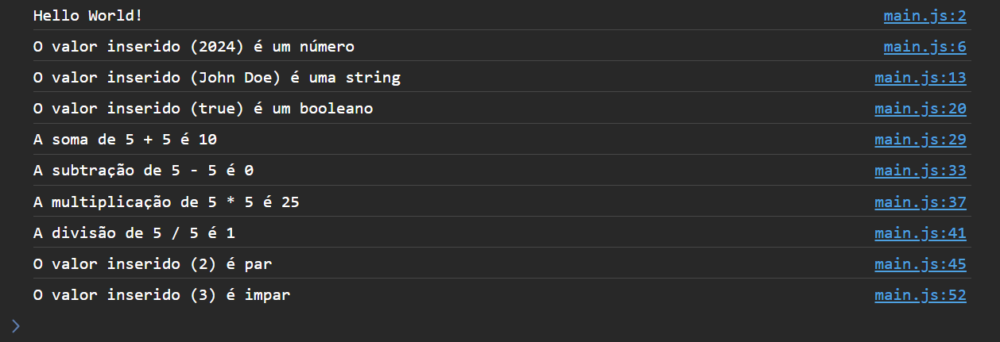

  

   
   

  

    <a href="#-desafio">Desafio</a>&nbsp;&nbsp;&nbsp;|&nbsp;&nbsp;&nbsp;
    <a href="#-tela">Tela</a>&nbsp;&nbsp;&nbsp;|&nbsp;&nbsp;&nbsp;
    <a href="#-demonstracao">Demonstração</a>&nbsp;&nbsp;&nbsp;|&nbsp;&nbsp;&nbsp;
    <a href="#-contato">Contato</a>
  

  
  

## Sobre o Desafio
Este exercício JavaScript faz parte da trilha Explorer oferecida pela Rocketseat. O objetivo principal é praticar e rever tudo o
que foi ensinado na aula como: estrutura de dados com objetos, estrutura de repetição, criação de funções, operadores comparativos e condicional

Nesse desafio crie um arquivo `main.js` que é onde você vai resolver os exercícios abaixo:

1. Crie um script que exiba a mensagem `Hello World!` em um alerta no navegador
2. Crie um script que declare uma variável e verifique se o seu valor é um número Se for, exiba a mensagem `É um número`, caso contrário, exiba a mensagem `Não é um número`
3. Crie um script que declare uma variável e verifique se o seu valor é uma string. Se for, exiba a mensagem `É uma string`, caso contrário, exiba a mensagem `Não é uma string`
4. Crie um script que declare uma variável e verifique se o seu valor é um booleano. Se for, exiba a mensagem `É um booleano`, caso contrário, exiba a mensagem `Não é um booleano`
5. Crie um script que declare duas variáveis e exiba o resultado da soma entre elas
6. Crie um script que declare duas variáveis e exiba o resultado da subtração entre elas
7. Crie um script que declare duas variáveis e exiba o resultado da multiplicação entre elas
8. Crie um script que declare duas variáveis e exiba o resultado da divisão entre elas
9. Crie um script que declare uma variável e verifique se o seu valor é um número par. Se for, exiba a mensagem `É um número par`, caso contrário, exiba a mensagem `Não é um número par`
10. Crie um script que declare uma variável e verifique se o seu valor é um número ímpar. Se for, exiba a mensagem `É um número ímpar`, caso contrário, exiba a mensagem `Não é um número ímpar`.

## Tela de resultado

## Demonstração
Aqui está uma prévia do resultado final do desafio desenvolvido
[Link Demonstração](https://joao-sillva.github.io/desafios-js/)

## Contato
Se você tiver alguma dúvida ou quiser entrar em contato, você pode me enviar uma mensagem pelo
[LinkedIn](https://www.linkedin.com/in/joao-sillva/).

(<a href="#readme-top">voltar ao topo</a>)
